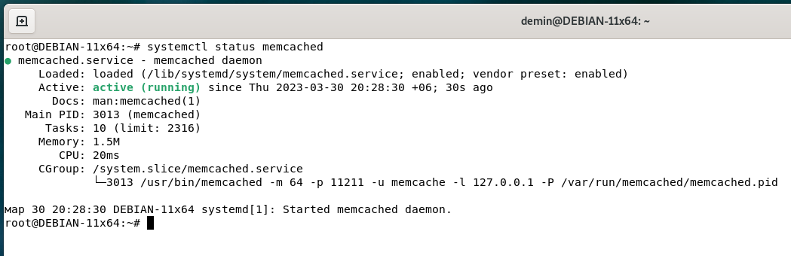

# Домашнее задание к занятию 11.2. «Кеширование Redis/memcached» Андрей Дёмин

### Задание 1. Кеширование 

Приведите примеры проблем, которые может решить кеширование. 

*Приведите ответ в свободной форме.*

Задачи кэша - приблизить данные к месту их использования и увеличить производительность систем хранения и обработки данных.
Кэширование позволяет:
- ускорить загрузку как отдельных файлов, например, изображений и мультимедиа, так и определенные части веб-сайтов, составляющие их неизменяемый контент, например, значки навигации, стили, сценарии Javascript;
- сэкономить ресурсы сервера, например, выдавая кэшированные веб-страницы целиком то есть обрабатывать большое количество запросов даже на самом слабом сервере со скоростью работы памяти и с незначительным задействованием процессора;
- снизить нагрузки на сети при использовании кэширующих прокси-серверов.

---

### Задание 2. Memcached

Установите и запустите memcached.

*Приведите скриншот systemctl status memcached, где будет видно, что memcached запущен.*

---

### Задание 3. Удаление по TTL в Memcached

Запишите в memcached несколько ключей с любыми именами и значениями, для которых выставлен TTL 5. 

*Приведите скриншот, на котором видно, что спустя 5 секунд ключи удалились из базы.*

---

### Задание 4. Запись данных в Redis

Запишите в Redis несколько ключей с любыми именами и значениями. 

*Через redis-cli достаньте все записанные ключи и значения из базы, приведите скриншот этой операции.*

---

---

